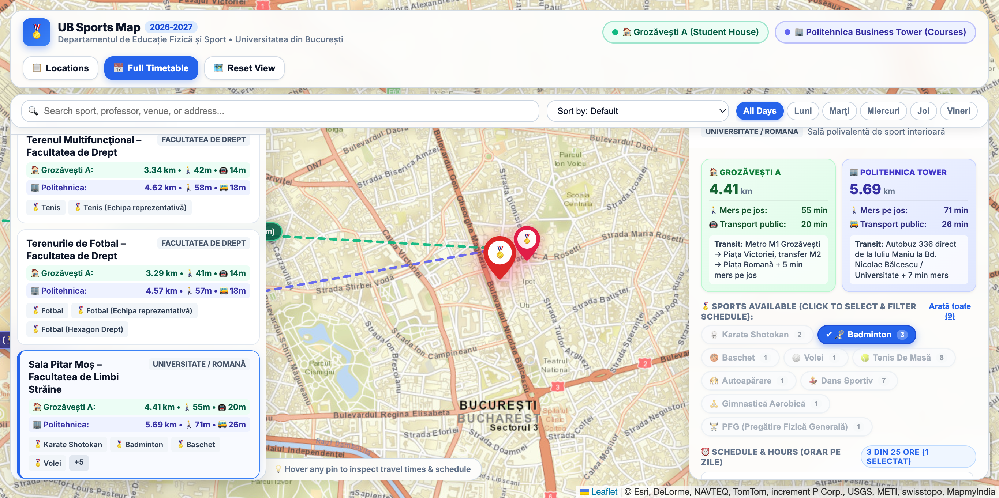

# UB Sports Map and Timetable (2026–2027)

Every semester at University of Bucharest we get the same chaotic sport timetable exported from a Word document. It lists thirteen different halls, fields, and stadiums spread across the whole city, from Pitar Moș to the lakes in Titan and all the way out to Măgurele. Most of us live in Grozăvești A or spend half our day at Politehnica Business Tower for lectures, so figuring out where to do our mandatory physical education class without spending three hours on the tram is always a pain.

This project turns that messy timetable into a big interactive map. It helps you see where every sport takes place, how far it is from your dorm or classes, and lets you filter the hours without reading through dozens of tables.

You can try the live version directly on Netlify at https://ub-sports-defs-2026.netlify.app or run it on your own machine.

## What You Can Do With It

The main screen is a full map of Bucharest with pins for all thirteen sports locations. You will immediately notice two special reference markers with green and indigo badges. One marks Cămin Grozăvești A where many of us live, and the other marks Politehnica Business Tower where our courses are held.

When you hover your mouse over any sports pin, the map immediately draws dotted connection lines to both Grozăvești A and Politehnica Tower. Small floating badges right on the lines show the exact walking distance in kilometers, estimated walking time, and public transport travel time using the Bucharest metro and STB bus or tram lines.

Clicking on a venue opens its details panel on the right. Inside the Sports Available section, every sport badge works as a multi-select toggle button. If a hall hosts nine different activities like badminton, basketball, volleyball, and table tennis, you can click just the badminton badge to instantly filter the schedule below. It hides every other sport so you only see the hours you care about. You can also pick multiple sports at once, like badminton plus volleyball, and see their combined schedule grouped by day from Monday to Friday. Clicking a selected badge again deselects it, and the reset button brings back all sessions. Crucially, selecting sports inside a venue only filters that specific hall schedule, leaving the rest of the map pins visible so you never lose track of other locations.

There is also a search bar at the top where you can type a sport name, a teacher name like Sakizlian or Gozu, or a specific neighborhood. Quick day pills let you see which halls have classes on Monday, Tuesday, Wednesday, Thursday, or Friday. If you need the complete picture, the Full Timetable button opens a modal window with all one hundred and forty-one university sessions in one searchable table. In the bottom right corner you can switch between a clean street map, classic OpenStreetMap, and high-resolution satellite imagery.

## How It Works Under The Hood

The raw data comes directly from timetable.html, which was parsed using a Python script with BeautifulSoup. The parser reconstructs the table grids while properly handling merged rows and columns, extracting the day, time slot, discipline, instructor, and any special qualifiers such as competitive teams or law faculty groups. The parsed result is stored in data.json and data.js.

Distances were measured using the OpenStreetMap road network and the OSRM routing engine to get true street walking kilometers rather than straight-line approximations. Transit times and route descriptions are based on Bucharest metro line one and line three, tram lines one, ten, and eleven along Vasile Milea, and local buses like three hundred and thirty-six.

The front end is built with standard HTML5, modern CSS, and vanilla JavaScript without any heavy framework overhead. The map is powered by Leaflet using vector-styled tiles from Esri and OpenStreetMap. All Leaflet script and stylesheet dependencies are stored locally in the assets folder so the application works smoothly even without external library CDNs.

<!--- Sunt prea lenes sa scriu README. asta e prompt-ul folosit pentru a genera README-ul asta:
 we are ready to push it to github. create a good readme: b1 lingo, no bullet points or marketing shit. the tone is that of a student sharing the app with fellow     
  students. put a screenshot, document the tech and the features. here is the origin "https://github.com/nstefan13/fmi-slop-orar-sport-2026.git" 
--->
